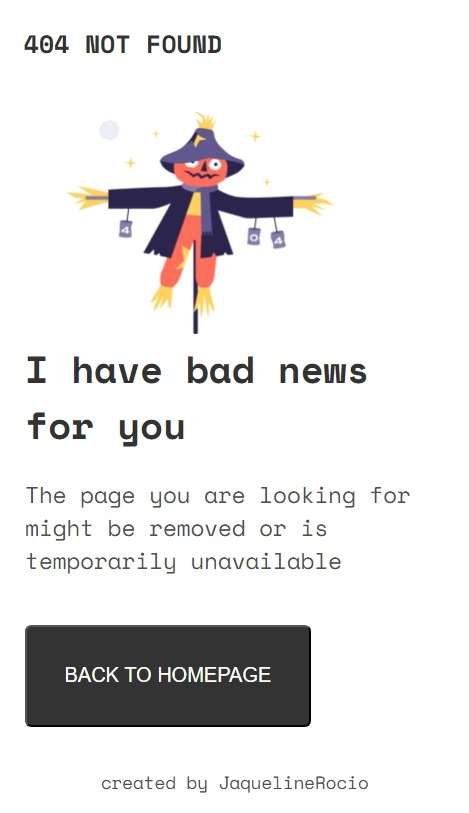

# Make It Real - 404 NOT FOUND PAGE

This is a solution to the 404-not-found-page project of the Make It Real course.

## Table of contents

- [Overview](#overview)
  - [The challenge](#the-challenge)
  - [Screenshot](#screenshot)
- [My process](#my-process)
  - [Built with](#built-with)
  - [What I learned](#what-i-learned)
  - [Continued development](#continued-development)
  - [Useful resources](#useful-resources)
- [Author](#author)
- [Acknowledgments](#acknowledgments)

## Overview

### The challenge

Users should be able to:

- View a responsive 404 page that adapts to different screen sizes.
- Understand the error message clearly with a distinct visual that represents the error.
- Navigate back to the homepage via a button.

### Screenshot




## My process

### Built with

- Semantic HTML5 markup
- CSS custom properties
- Flexbox
- Mobile-first workflow

### What I learned

In this project, I reinforced my understanding of the mobile-first workflow and how to effectively use Flexbox to create a responsive layout. Additionally, I deepened my knowledge of using _media queries_ to adapt the design for different screen sizes.

To see how you can add code snippets, see below:

```css
@media (min-width: 768px) {
  main {
    flex-direction: row;
    align-items: center;
    justify-content: center;
    gap: 50px;
  }
```

### Useful resources

- [CSS-Tricks - A Complete Guide to Flexbox](https://css-tricks.com/snippets/css/a-guide-to-flexbox/) - This guide helped me understand how to use Flexbox to center content effectively.
- [MDN Web Docs - Responsive design](https://developer.mozilla.org/en-US/docs/Learn/CSS/CSS_layout/Responsive_Design) - This article provided a comprehensive overview of responsive design principles, which I applied in this project.

## Author

- GitHub - [JaquelineRocio](https://github.com/JaquelineRocio)

## Acknowledgments

I would like to thank the Make It Real team for providing this challenge and the helpful resources throughout the course. Additionally, I appreciate the feedback from peers and instructors that helped refine my approach to building this project.
